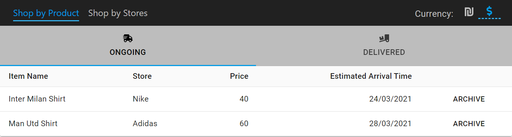
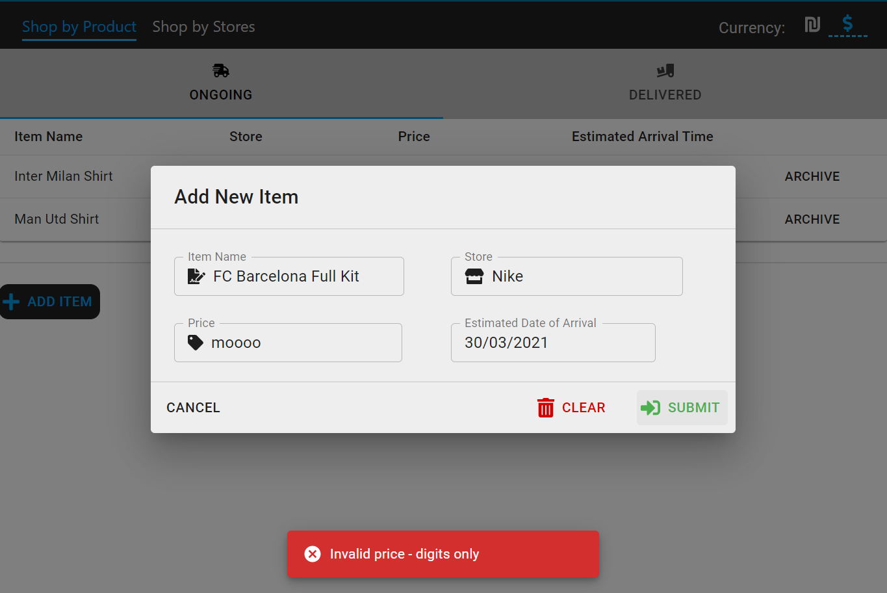

# Shopping Tracker - Herolo Assignment

Welcome to my Shopping Tracker - a simple application that helps you not getting all over the place with spending money while shopping. You simply add the item with its details to the list, and you can easily see how much you spend, where you spend it, and what things you tend to buy. You can also gather your online orders and mark them to see what has already arrived and what is still on its way.

The application is made with responsive UI design using Google's Material-UI, and consistently updates the ILS/USD rates.

---

## **Structure**

The Project consists of two main dashboards - Products Tracking, and Stores Tracking. The transition between these dashboards uses React Router, where each dashboard has its own route, and a tabs navigation menu.

Navigation Bar - has two links for the corresponding routes, and a currency view of either USD or ILS.

Products Tracking - this dashboard has its own menu, two tabs to filter the displayed products, a tab for the delivered ones, and another tab for the ongoing orders. The user has an option to add items from a list, and a button that allows him/her to fill details and add an item to the list. Each item then can be marked as delivered using a button displayed next to the other details, and reactivated using a similar button.

Add Item Modal - when a user clicks the "Add Item" button a modal pops up and inside there is a form to fill out the item's details.

Store Tracking - this dashboard has the list of all the stores, sums up the payment in each one of them, and the overall amount paid altogether.

Snackbar - the app has a snackbar, which adds more interaction with the user, gives him/her feedback for their actions, for example, an error snackbar message due to invalid inputs in an item's details filling, or a success message when an item has been added to the list.

**Have a look!**

